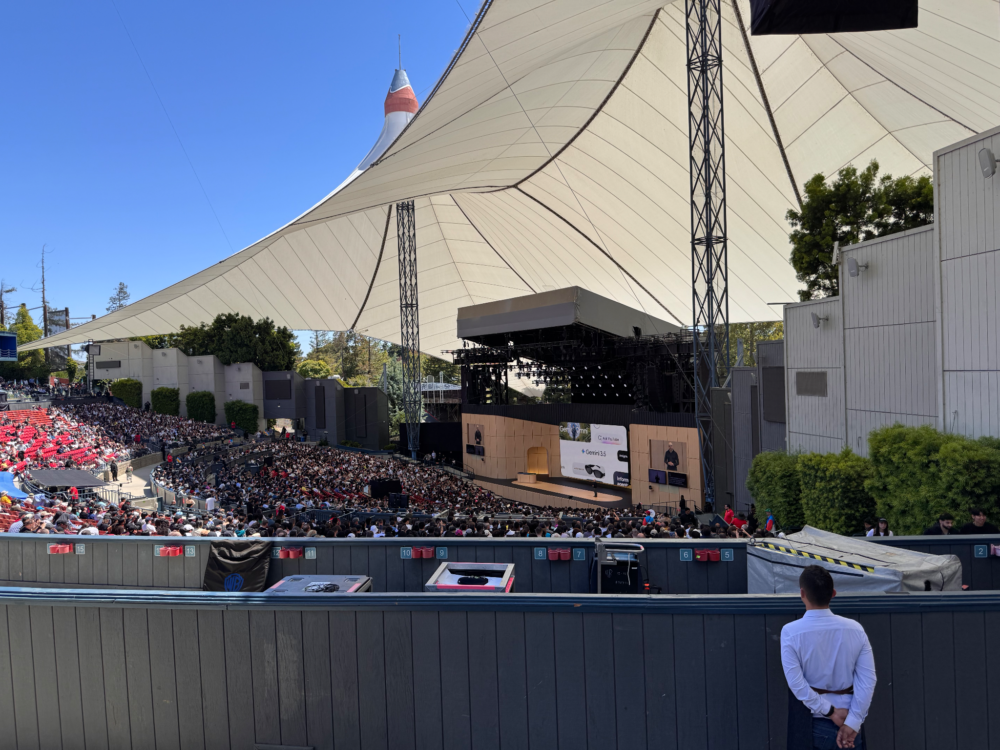

I was fortunate to attend Google's I/O developer summit earlier this week. Here are my top takeaways.

## **The Chrome Team is Taking Your Coding Agents to the Next Level**

The Chrome team announced [Modern Web Guidance](https://developer.chrome.com/docs/modern-web-guidance) as well as [Chrome DevTools For Agents](https://developer.chrome.com/docs/devtools/agents). Both of which are incredibly easy to integrate into your workflow. The new DevTools MCP leverages puppeteer to control chrome via exposed tools and includes access to lighthouse audits and detailed performance traces. I was able to utilize [pi-autoresearch](https://github.com/davebcn87/pi-autoresearch) to run a benchmark utilizing the new MCP and improved the page performance on eDNA Explorer while I slept during the last two nights.

Modern web guidance is also an instant win if you're dealing with any front-end development. This curated set of skills will upskill your coding agent for the foreseeable future. Models are trained on a wealth of code and much of it is legacy code. That means the output you get from your agent is usually not the best approach as the agent implements solutions using outdated APIs or bloats your code with cross compatible solutions that just aren't needed anymore. I believe this will be a set of skills nearly everyone will want to expose their coding agent to.

## Web MCP is Very Promising

It took me a bit to grok the diff between MCP and **[WebMCP](https://developer.chrome.com/docs/ai/webmcp)** - but 10 mins into the session at I/O it all clicked for me. Right now, an agent visiting your site is utilizing screenshots or groking the DOM. The agent has to utilize these inefficient techniques to learn what it can do on your website — expensive in both tokens and time.

Enter WebMCP. Think of this as exposing an API for the UI of the current page to your agent. You can register core UX actions on any given page like `search`, `signup`, `checkout`, etc. as tools. You register hooks or callbacks with an MCP API built into Chrome. WebMCP is only available via experimental flags and a chrome plugin for anyone who wants to start experimenting with the future today.

## Google and Anthropic Have their OpenClaw Competitors

[Gemini Spark](https://gemini.google/overview/agent/spark/) is Google's answer to [OpenClaw](https://openclaw.ai). Anthropic has released [Dispatch](https://dev.to/anthropic/claude-dispatch-in-2-minutes-phone-to-desktop-ai-setup-4k2l) and [Routines](https://www.infoq.com/news/2026/05/anthropic-claude-code-routines/) which so far is their answer as chipping away at the major use cases for OpenClaw. This somewhat conspicuously leaves OpenAI without an actual first class autonomous agent option. I'm curious to see what they end up offering given they're the only frontier model provider that allows you to use your subscription with OpenClaw.

Spark delivers immediate value for anyone heavily invested in the Google ecosystem. If you are already doing everything in Google Workspace you'll get a lot of leverage from Spark right away. We use workspace internally so I'm excited to test it out.

## Gemini 3.5 Flash Looks Promising

[Gemini 3.5 Flash](https://blog.google/innovation-and-ai/models-and-research/gemini-models/gemini-3-5/#real-world) seemed too good to be true when google announced the performance and speed. Later I discovered the cost had increased, which makes sense given the performance gains. Even so, it's about [half the price of sonnet 4.6](https://www.llmreference.com/compare/claude-sonnet-4-6/gemini-3.5-flash) and the benchmark performance looks to be comparable or superior to sonnet. I guess we'll have to see when Sonnet 4.7 drops. In the mean time I'm looking forward to trying this model out with pi-agent to see how it does as a daily driver at 240 TPS.

## Not Everyone was Happy About Losing their IDE

Some people I talked to at the conference were not happy with the overhaul of the [Antigravity IDE](https://antigravity.google). While 1.0 was more akin to Cursor, 2.0 changes the app into an agent centric chat manager. Antigravity is now like the Codex or Claude Code desktop apps. Unlike other IDEs that added agent modes alongside traditional editing, Antigravity replaced its entire interface. Developers who switched to Antigravity as their daily driver last year are not happy about this and I can't blame them. I personally recommend using Zed as it's performant.

## Tons of GenMedia Promotion

I was surprised the [Gemini Omni](https://blog.google/technology/ai/google-gemini-omni-io-2026/) took precedence over the flash announcement given the main use case they shared is video generation. While it's far more than that and the model is very impressive, the video and image gen do not seem to be the top use case for AI right now. Look at Anthropic's rapid revenue growth—they don't offer GenMedia at all. All that being said, I was able to get a coffee generated by [nano banana](https://blog.google/technology/ai/google-nano-banana-2-gemini-3-1-flash-image/).
